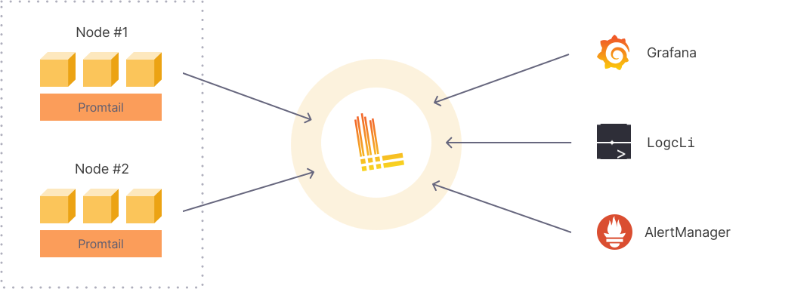

[Ondrej Sika (sika.io)](https://sika.io) | <ondrej@sika.io>| [**Skoleni Loki**](https://ondrej-sika.cz/skoleni/loki/) 🚀💻

# Loki Training: Log Management in Grafana


## What is Loki

Loki is a horizontally scalable, highly available, multi-tenant log aggregation system inspired by Prometheus. It is designed to be very cost effective and easy to operate. It does not index the contents of the logs, but rather a set of labels for each log stream.

-- https://grafana.com/oss/loki/

## How does Grafana Loki work?



## Example of log line


## Loki Components

- https://grafana.com/docs/loki/latest/get-started/components/

- **Distributor** - The distributor service is responsible for handling incoming push requests from clients.
- **Ingester** - The ingester service is responsible for persisting data and shipping it to long-term storage.
- **Querier** - The querier service is responsible for executing Log Query Language (LogQL) queries from clients.
- **Query Frontend** - The query frontend is an optional service providing the querier’s API endpoints and can be used to accelerate the read path.
- **Query Scheduler** - The query scheduler is responsible for distributing query load across queriers.
- **Index Gateway** - The index gateway service is responsible for handling and serving metadata queries.
- **Compactor** - The compactor service is used by “shipper stores”, such as single store TSDB or single store BoltDB, to compact the multiple index files produced by the ingesters and shipped to object storage into single index files per day and tenant.
- **Ruler** - The ruler service manages and evaluates rule and/or alert expressions provided in a rule configuration.

## Loki Deployment Models

- https://grafana.com/docs/loki/latest/get-started/deployment-modes/

## Loki Monolithic


## Loki Scalable


## Install Mac

```
brew install loki
brew install promtail
brew install logcli
```

## Install Linux (using slu)

```
slu ib loki
slu ib promtail
slu ib logcli
```

## logcli completion

For zsh, add this to your ~/.zshrc file:

```
eval "$(logcli --completion-script-zsh)"
```

For bash, add this to your ~/.bashrc file:

```
eval "$(logcli --completion-script-bash)"
```

## Run Loggen

```
slu loggen > /tmp/example.log
```

## Run Loki

```
loki -config.file examples/loki/loki.simple.yml
```

## Run Promtail

```
promtail -config.file examples/promtail/promtail.simple.yml
```

## Run Logcli

```
logcli query '{job="example"}' --follow
```

## fluent-bit example

## Install fluent-bit on Mac

```
brew install fluent-bit
```

## Run fluent-bit

```
fluent-bit -c examples/fluentbit/fluentbit.conf
```

See logs in Loki using Logcli:

```
logcli query '{job="fluentbit"}' --follow
```

## Alloy

## What is Alloy

Grafana Alloy is a vendor-neutral distribution of the OpenTelemetry (OTel) Collector. Alloy uniquely combines the very best OSS observability signals in the community.

Alloy offers native pipelines for OTel, Prometheus, Pyroscope, Loki, and many other metrics, logs, traces, and profile tools.

-- https://grafana.com/docs/alloy/latest/

## Install Alloy

On Mac:

```
brew install grafana/grafana/alloy
```

On Linux (using slu):

```
slu ib alloy
```

VS Code Extension:

- https://marketplace.visualstudio.com/items?itemName=Grafana.grafana-alloy

## Convert Promtail config to Alloy

- https://grafana.com/docs/alloy/latest/set-up/migrate/from-promtail/

```
alloy convert --source-format=promtail --output=<OUTPUT_CONFIG_PATH> <INPUT_CONFIG_PATH>
```

```
alloy convert --source-format=promtail --output=examples/alloy/simple.alloy examples/promtail/promtail.simple.yml
```

## Run Alloy

```
alloy -config.file examples/alloy/simple.alloy
```

check using logcli:

```
logcli query '{job="alloy"}' --follow
```

## Send logs from Go application

```
(cd examples/example_go && go run .)
```

## Grafana

## Run Grafana

```
make -C examples/docker/grafana up
```

or

```
docker run -p 3000:3000 grafana/grafana
```

## LogQL - Log Query Language

- https://grafana.com/docs/loki/latest/query/

### Log Stream Selector

```logql
{prefix="logql"}
```

```logql
{prefix="logql", instance="0"}
```

```logql
{prefix="logql", instance!="0"}
```

```logql
{prefix="logql", instance="us-0"}
```

```logql
{prefix="logql", instance=~"us-.*"}
```

```logql
{prefix="logql", instance!~"us-.*"}
```

### Log Filter Expression

- `|=` - Log line contains string
- `!=` - Log line does not contain string
- `|~` - Log line contains a match to the regular expression
- `!~` - Log line does not contain a match to the regular expression

```logql
{prefix="logql"} |= "and not handled"
```

```logql
{prefix="logql"} != "and not handled"
```

```logql
{prefix="logql"} |~ "context|igno"
```

```logql
{prefix="logql"} !~ "context|igno"
```

### line_format

```logql
{prefix="logql"} | line_format "{{.prefix}}"
```

```logql
{prefix="logql"} | line_format "{{.prefix}}-{{.instance}}-{{.level}}"
```

### logfmt

Parse all `key=value` pairs from log lines.

```logql
{prefix="logql"} | logfmt
```

```logql
{prefix="logql"} | logfmt | line_format("{{.i}}")
```

### label_format

Rename labels `i` to `counter`.

```logql
{prefix="logql"} | logfmt | label_format counter=i
```

### json

Parse JSON log lines.

```logql
{prefix="logql-json"} | json
```

### decolorize

```logql
{app=~".*tergum.*"}
```

```logql
{app=~".*tergum.*"} | decolorize
```

### count_over_time

```logql
count_over_time({prefix="logql"}[1m])
```

```logql
sum(count_over_time({prefix="logql"}[1m]))
```

```logql
sum(count_over_time({prefix="logql"}[10m]))
```

```logql
sum(count_over_time({prefix="logql"}[1m])) by (instance)
```

```logql
sum(count_over_time({prefix="logql"}[1m])) by (level)
```

## logcli

### logcli query

by default listens on `localhost:3100`

```
logcli query '{prefix="logql"}'
```

specify loku address using `--addr`

```
logcli query --addr http://loki.sikademo.com:3100 '{prefix="logql"}'
```

or using `LOKI_ADDR` environment variable

```
export LOKI_ADDR=http://loki.sikademo.com:3100
logcli query '{prefix="logql"}'
```

follow logs

```
logcli query '{prefix="logql"}' --follow
```

no labels

```
logcli query '{prefix="logql"}' --no-labels
```

quiet mode (no headers)

```
logcli query '{prefix="logql"}' --quiet
```

```
logcli query '{prefix="logql"}' --no-labels --quiet
```

output format

```
logcli query '{prefix="logql"}' --output raw
```

```
logcli query '{prefix="logql"}' -o jsonl
```

output format and quiet mode

```
logcli query '{prefix="logql"}' --quiet --output raw
```

```
logcli query '{prefix="logql"}' -q -o jsonl
```

### logcli labels

List all labels

```
logcli labels
```

List all labels with values

```
logcli labels <label>
```

```
logcli labels level
```

### logcli series

List all series

```
logcli series '{}'
```

List all series with labels

```
logcli series '{prefix="logql"}'
```

```
logcli series '{prefix="logql", instance="0"}'
```

## Run Alertmanager

```
alertmanager --config.file ./examples/alertmanager/alertmanager.yml
```

## Run Loki with Alerting

See diff of Loki config files

```
vimdiff examples/loki/loki.simple.yml examples/loki/loki.alerting.yml
```

See `rules.yml`

```
cat examples/rules/fake/rules.yml
```

Run Loki with alerting

```
loki -config.file examples/loki/loki.alerting.yml
```

## Run Maildev

```
docker run --name maildev -d -p 1080:1080 -p 1025:1025 maildev/maildev
```

## Make Errors

```
slu loggen -s 10 --loki-url http://127.0.0.1:3100/loki/api/v1/push -p logql --no-info --no-warn --no-debug
```

## Loki Canary

Loki Canary is a standalone app that audits the log-capturing performance of a Grafana Loki cluster.

This component emits and periodically queries for logs, making sure that Loki is ingesting logs without any data loss. When something is wrong with Loki, the Canary often provides the first indication.

-- https://grafana.com/docs/loki/latest/operations/loki-canary/


```
1557935669096040040 ppppppppppppppppppppppppppppppppppppppppppppppppppppppppppp
```


## Doggos

[](https://www.instagram.com/wild.loki.appears/)
[](https://www.instagram.com/loki/)

[@wild.loki.appears](https://www.instagram.com/wild.loki.appears/)

[@loki](https://www.instagram.com/loki/)

## Thank you! & Questions?

That's it. Do you have any questions? **Let's go for a beer!**

### Ondrej Sika

- email: <ondrej@sika.io>
- web: <https://sika.io>
- twitter: [@ondrejsika](https://twitter.com/ondrejsika)
- linkedin: [/in/ondrejsika/](https://linkedin.com/in/ondrejsika/)
- Newsletter, Slack, Facebook & Linkedin Groups: <https://join.sika.io>

_Do you like the course? Write me recommendation on Twitter (with handle `@ondrejsika`) and LinkedIn (add me [/in/ondrejsika](https://www.linkedin.com/in/ondrejsika/) and I'll send you request for recommendation). **Thanks**._

Wanna to go for a beer or do some work together? Just [book me](https://book-me.sika.io) :)
